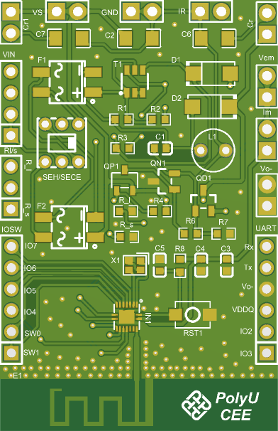

# Compact IoT Board for Electromechanical Metamaterials

 

This repository contains the open-source design files for a compact, self-powered IoT board featuring the SECE AC-DC interface circuit, the three-transistor energy management module for DC-DC conversion, and an ultra-low-power Bluetooth Beacon for sensing and transmission.

## Key Features

- **Energy Harvesting Interface**: Compatible with the SECE (Synchronous Electric Charge Extraction) interface circuit and the full bridge rectifier.
- **Three-Transistor Energy Management**: 
  - Adjustable regulation voltage thresholds (`V_ON` and `V_OFF`)
  - Regulated output voltage ~2.3V (suitable for most IoT SoCs)
- **Ultra-Low-Power Bluetooth Beacon**:
  - IN100 SoC for internal temperature and VCC sensing
  - BMA400 accelerometer via I²C
  - Bluetooth broadcasting (channels 37-39) at 1s intervals
- **Power-Saving Operation**:
  - Dynamic sleep/wake cycles
  - Load switch for external sensor power management
- **Configurable Thresholds**:
  - Adjustable `V_ON` via onboard resistor `R5` selection
  - Supports heavy-sensing and transmission tasks

## Repository Contents

- `/PCB`:
  - PCB fabrication files (Gerber, BOM, etc.)
  - Schematic (PDF)
- `/codes`:
  - IN100 configuration code
  - Bluetooth sniffer (ESP32 series)
- `/pics`:
  - PCB 3D picture

## Technical Specifications

| Parameter          | Value/Range       |
|--------------------|-------------------|
| Input Voltage Range| AC voltage >= 5V |
| Regulated Output   | ~2.3V             |
| Broadcast Interval | 1 second          |
| Sensors            | On-chip temperature, BMA400 3-axis accelerometer, etc. |
| Sleep Current      | 700 nA        |
| Active Current     | 10~30 mA        |

## Getting Started

1. **Manufacturing**:
   - Use the Gerber files in `/PCB` for PCB fabrication
   - Refer to BOM for component sourcing

2. **Assembly**:
   - Follow the assembly guide in the referenced papers
   - Select `R5` for desired threshold voltage

3. **Programming**:
   - Configure the IN100 SoC using the codes in `/codes`
   - Configure Bluetooth sniffer as needed

## Citation

If you use this open-source design in your research or project, please cite the following papers: 

- Zhao, Bao, et al. "EMetaNode: Electromechanical Metamaterial Node for Broadband Vibration Attenuation and Self-powered Sensing"

## License

This project is open-source under [MIT License].

## Contributing

Contributions are welcome! Please submit issues or pull requests for any improvements.

---

*For detailed performance characteristics and design considerations, refer to the documentation and cited papers.*
